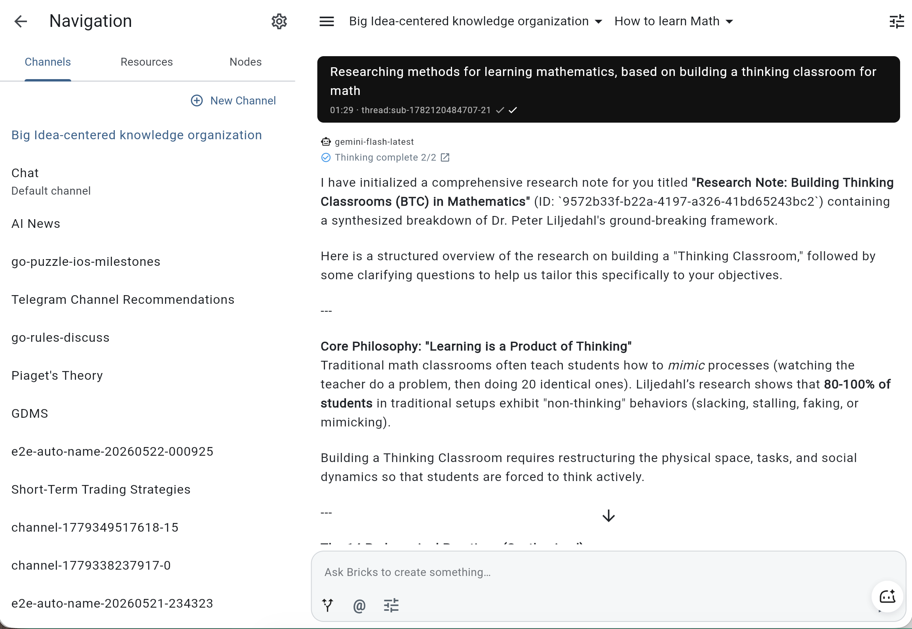
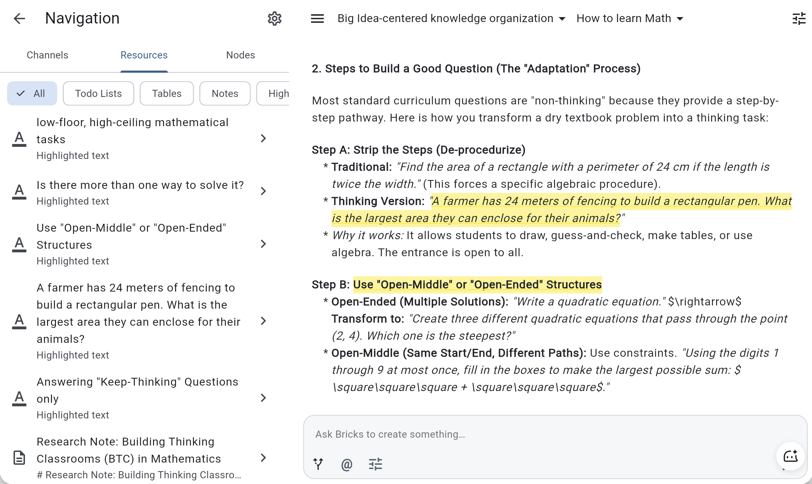

# Bricks

**The agent console for tinkerers.**

Bricks helps you run AI work across conversations, OpenClaw nodes, and durable workspace resources.

## What Bricks does today

- Capture useful information from chat as todos, tables, notes, and highlights
- Keep different topics separated with channels and threads, like Discord
- Connect OpenClaw and route messages to specific agent nodes
- Configure AI model providers, channel instructions, thread instructions, and node tokens
- Automate recurring agent tasks on a schedule
- Fully open source: Flutter app, Node backend, mobile clients, docs, and plugin runtime

## What you can save

Bricks keeps useful information available after the chat moves on.

- **Todo Lists** - Project checklists, follow-up tasks, meeting actions, and homework plans.
- **Tables** - Comparison matrices, research trackers, lead lists, bug triage, and planning data.
- **Notes** - Research summaries, reusable instructions, generated reports, study notes, and specs.
- **Highlights** - Important facts, decisions, quotes, references, and snippets worth keeping.

## Showcase

### Topic-based agent work



### Saved highlights and notes



## What's on the roadmap

- Richer note content, including purpose-specific charts, diagrams, and examples
- Grammar issue collection for review, reuse, and analysis
- Website artifacts for saving generated pages and interactive previews
- Charts for turning structured data into visual summaries
- Motion outputs for animation, timing, and visual storytelling
- GitHub integration for issues, pull requests, and repository workflows

[Tell us your story or request a feature](https://github.com/askman-dev/bricks/issues/new)

## Documentation

The repository docs are now organized in a Docusaurus-friendly information architecture under `docs/`:

- [docs/intro.md](docs/intro.md) — entry page
- [docs/product/](docs/product/overview.md) — product overview and capabilities
- [docs/get-started/](docs/get-started/quickstart.md) — quick setup and local run path
- [docs/integrations/](docs/integrations/openclaw-plugin.md) — OpenClaw / platform integration guidance
- [docs/architecture/](docs/architecture/system-overview.md) — system architecture and package layout
- [docs/faq/](docs/faq/common-issues.md) — common issues and troubleshooting pointers


## Docs site (Docusaurus)

The docs site is managed as an independent project in `apps/docs_site/` and renders content from the repository root `docs/` directory.

```bash
cd apps/docs_site
npm install
npm run start
npm run build
```

## Quick setup

```bash
./tools/init_dev_env.sh
```

For complete local setup and validation commands, see:

- [docs/get-started/quickstart.md](docs/get-started/quickstart.md)
- `BUILD.md`
